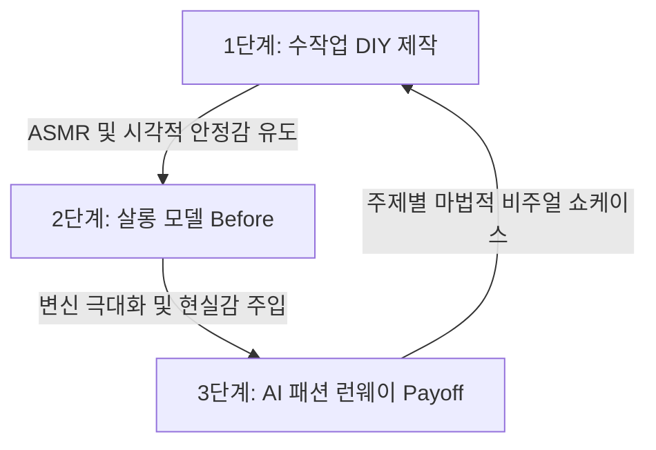
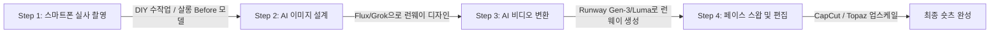

# 📊 @dresqelle 유튜브 숏츠 채널 상세 분석 보고서
> **작성일:** 2026년 6월 4일
> **작성자:** 코다리 PM (Antigravity)
> **목적:** 수작업 DIY와 AI 패션 쇼케이스를 결합한 폭발적 성장 공식 분석 및 1인 제작 파이프라인 수립

---

## 📸 채널 개요 및 성적
*   **채널명:** Dresqelle (@dresqelle)
*   **구독자 수:** 약 2.81만 명 (신생 채널이나 조회수 폭발 중)
*   **가입일:** 2026년 4월 14일 (비교적 최근 생성됨)
*   **채널 특징:** 실제 수작업 DIY(보석 본딩, 몰딩, 미니어처 드레스 제작) 과정의 ASMR 만족감으로 유저를 Hooking한 뒤, 뷰티 살롱 비포(Before) 모델을 거쳐, 화려한 AI 생성 패션 런웨이(Payoff)로 완성하는 하이브리드 포맷.
*   **타겟층:** 아랍어권 로컬라이징(제목 및 자막)을 취하고 있으나, 언어 장벽이 전혀 없는 100% 비주얼 스토리텔링으로 글로벌 알고리즘을 강타 중.

---

## 💎 핵심 기획 공식 (Core Viral Loop)
이 채널의 성공은 단순 AI 생성 이미지의 나열이 아니라, **"실사(현실 감각)와 AI(가상 카타르시스)"를 영리하게 연결하는 3단계 전개 구조**에 있습니다.

| 3단 전개 단계 | 연출 기법 | 시청 심리 (Dopamine Point) |
| :--- | :--- | :--- |
| **1단계: DIY 제작 (0~30초)** | 스마트폰 촬영 실사. 레진아트, 진주/보석 붙이기, 글루건 조형 등 손기술을 타이트하게 잡은 ASMR 및 클로즈업. | 무의식적 만족감(Satisfying), "이걸로 대체 뭘 만들려는 거지?"라는 호기심 유발. |
| **2단계: Before 모델 (30~45초)** | 실제 인물(금발 백인 여성 또는 아시아계 여성 등)이 헤어 살롱 의자에 쌩얼로 앉아 머리 만지는 2~3초의 컷씬. | 현실 인물 등장으로 채널의 가짜/AI 거부감 완전 제거 및 인간적 감정이입. |
| **3단계: AI 런웨이 (45~60초)** | Runway Gen-3 / Luma Dream Machine으로 생성된 슬로모션 패션쇼 런웨이. 1단계의 DIY 요소가 결합된 드레스를 입은 2단계의 모델이 등장. | **비포/애프터의 카타르시스.** "내 이름이 적힌 명찰이 드레스가 됐네?", "물고기 어항이 옷이 됐네?" 등의 충격과 경외감. |

---

## 🎬 인기 숏츠 분석 (Top 3)

### 1위. "이름 명찰 드레스" 숏츠 (조회수 ~3.6M)
*   **내용**: 실리콘 몰드에 반짝이와 진주 알갱이를 넣어 'Manal(아랍어 이름 منال)' 명찰을 레진으로 이쁘게 만드는 수작업을 길게 보여줍니다. 이후 미용실 의자에 쌩얼로 앉아있는 금발 여성이 나온 뒤, 런웨이 무대에서 가슴 한가운데에 방금 만든 'Manal' 명찰이 찬란하게 빛나는 핑크-블루 투톤 시폰 드레스를 입고 캣워크를 걷습니다.
*   **기술 분석**: 런웨이 모델의 얼굴 뼈대와 눈빛이 살롱 의자의 여성과 거의 흡사합니다. AI 비디오 생성 모델의 **IP-Adapter 얼굴 고정** 기능 또는 생성 후 **얼굴 영역 페이스 스왑(Face Swap)** 처리 기술을 정교하게 결합한 흔적이 보입니다.

### 2위. "노란색 태양 모자 & 레이스 장갑" 숏츠 (조회수 ~2.2M)
*   **내용**: 미니어처 드레스 마네킹에 노란색 미니 모자를 씌우고 검은색 레이스 장갑 조각을 바느질하는 과정을 보여줍니다. 살롱 비포 컷에 이어, 런웨이에 등장한 모델이 1단계에서 만든 노란색 태양 모자와 검은색 레이스 장갑, 그리고 매치되는 옐로-블랙 하이컨트래스트 주름 드레스를 입고 슬로모션으로 걸어옵니다.
*   **기술 분석**: 카메라가 캣워크 정면에서 줌인(Slow Zoom-in)하는 동안 의상 주름의 물리 연산(Physics Simulation)이 극도로 부드럽습니다. 의류 전용 물리 제어가 뛰어난 Runway Gen-3 Alpha 계열의 비디오 렌더링이 의심됩니다.

### 3위. "바닷속 물고기 어항 드레스" 숏츠 (조회수 ~1.9M)
*   **내용**: 파란색 보석 링을 만들고 유리 물고기 어항 모형을 만지작거리는 1단계 제작에 이어, 바이올렛/연보라 헤어 모델의 비포 컷이 지나갑니다. 이윽고 런웨이에서 유리 어항 속에 실제로 파란 물이 출렁이고 금붕어가 헤엄치는 물리 구체 드레스와 고래 모양 헤드피스를 착용한 모델이 몽환적인 블루 라이팅 속에 등장합니다.
*   **기술 분석**: 중력과 유체(Fluid) 시뮬레이션이 결합된 고차원 AI 비디오 렌더링입니다. 일반적인 방법으로는 생성하기 힘든 "어항 옷 속에서 물이 출렁이며 물고기가 헤엄치는 모습"을 AI 프롬프트 제어를 통해 극도로 기괴하지 않고 환상적으로 렌더링해 냈습니다.

---

## 🛠️ 1인 AI 크리에이터의 벤치마킹 구현 로드맵 (Production Pipeline)

우리가 이 채널을 똑같이 구현하여 숏츠 채널을 런칭하려 할 때, 필요한 1인 제작 파이프라인 구성 방식입니다.

### 1단계. 소스 촬영 (실사 단계)
*   **장비**: 스마트폰 (아이폰/갤럭시 고해상도 모드) + 탑다운 거치대 + 링라이트.
*   **DIY 컷**: 다이소나 문구점에서 레진, 반짝이, 비즈 등을 구매해 무언가 이쁜 디자인의 오브젝트를 만드는 과정을 타이트한 구도로 촬영 (ASMR 마이크 필수).
*   **Before 컷**: 지인이나 크몽/Fiverr 모델, 혹은 본인의 상반신/얼굴 샷을 스마트폰으로 촬영 (머리를 정돈하거나 화장 없는 모습).

### 2단계. 의상 이미지 설계 (AI Generation)
*   **툴**: Flux / Grok 2.
*   **프롬프트 기법**: 1단계에서 만든 DIY 오브젝트의 재질(예: 블루 크리스탈, 골드 명찰 등)과 비포 컷 모델의 인종/외형 정보를 결합하여 캣워크를 걷는 고해상도 디자인 이미지를 만듭니다.
*   **핵심 키워드**: `fashion show catwalk runway, model walking towards camera, wearing custom dress made of [DIY 오브젝트 상세 묘사], luxury cinematic lighting, warm gold highlights, out of focus audience, photo taken by professional fashion photographer, 8k resolution, photorealistic.`

### 3단계. 캣워크 비디오 렌더링 (AI Video)
*   **툴**: Runway Gen-3 Alpha (Image-to-Video) 또는 Kling AI / Luma Dream Machine.
*   **방법**: 2단계에서 제작한 의상 디자인 키워드 이미지를 입력 소스로 넣고, 카메라를 인물 정면으로 천천히 끌어당기는 모션 지시(`Camera motion: Slow push in, dramatic catwalk walk cycle. Soft wind blowing hair. Highly consistent fabric movement.`)를 내려 6초~8초짜리 런웨이 비디오를 뽑아냅니다.

### 4단계. 최종 일관성 보정 & 마스킹 (Post-Production)
*   **얼굴 고정**: 생성된 런웨이 비디오 속 모델의 얼굴에 1단계에서 촬영한 'Before 모델'의 얼굴을 페이스 스왑(Face Swap Tool - 예: InsightFace, Roop, Refacer 등)을 적용해 일관성을 100%로 잠급니다.
*   **편집**: CapCut에서 1단계 실사 제작 컷(0~30초) + 2단계 살롱 비포 컷(30~33초) + 3단계 페이스스왑 런웨이 컷(33~45초)을 이어 붙이고 트렌디한 인스타그램/틱톡 릴스용 몽환적 배경음악과 글루건 바스락거리는 ASMR 사운드를 트랙에 얹습니다.

---

## 💡 코다리 부장의 총평 & 전략 제안
@dresqelle 채널은 **"수작업의 감성(인간의 영역)"**과 **"초현실적 비주얼(AI의 영역)"**의 경계를 가장 지능적으로 무너뜨린 2026년형 웰메이드 채널입니다. 

*   **즉시 적용할 아이디어**:
    우리가 준비하는 **'Cursed Hearts' 다크 판타지** 장르에도 이를 응용할 수 있습니다!
    1.  시작할 때 실제 수작업으로 검은색 레이스 장미 장식을 한 땀 한 땀 바느질하거나 만드는 과정을 실사로 보여줍니다. (호기심 극대화)
    2.  이후 엘라일라 역의 실사 모델(Before)을 잠깐 보여준 뒤,
    3.  그 장미가 이식된 드레스를 입고 어두운 숲속 안개 무대 속으로 캣워크하는 **카엘렌의 엘프 패션쇼 런웨이 비디오**로 전환하는 것입니다.

이 하이브리드 포맷은 단순 스토리텔링보다 글로벌 알고리즘의 유입 속도가 10배 이상 빠릅니다. 이 채널 분석을 바탕으로 테스트 숏츠 기획안을 준비해 볼까요? 대표님의 지시를 기다리겠습니다. ⚙️
