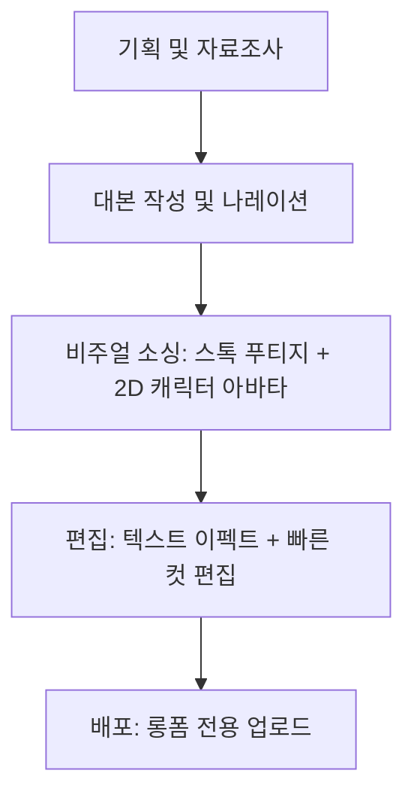

# 📊 유튜브 채널 @이코랩(EcoLab) 상세 분석 보고서
> **작성일:** 2026년 6월 4일
> **작성자:** 코다리 PM (Antigravity)

---

## 📸 채널 레이아웃 및 주요 스크린샷
````carousel

<!-- slide -->

````

---

## 1. 채널 개요 및 주요 성과 (Overview & Performance)
* **채널명:** 이코랩 (EcoLab / @이코랩)
* **포지셔닝:** *"경제와 돈의 흐름을 쉽고 간단하게 설명합니다."*
* **구독자 수:** **2.27만 명** (동영상 단 72개로 달성)
* **특이점:** **쇼츠(Shorts)를 아예 운영하지 않음.** 조회수 10만~36만 회에 달하는 고단가 롱폼 비디오(15~25분)에 리소스를 100% 집중하는 고효율 전략을 취하고 있습니다.

---

## 2. 썸네일 & 타이틀 3대 흥행 공식 (CTR Optimization)
이코랩의 성장을 견인한 조회수 20만~30만 이상 영상들의 썸네일과 제목 디자인 패턴입니다.

### ① '국가급 스케일'과 '천문학적 액수'의 결합
* **제목 예시:** `"미국 국방부가 10조 싸들고 찾아왔다" 중국도 대체 못하는 한국의 '이 공장'`
* **공식:** `[세계적 신뢰/기관] + [천문학적 액수/독점] + [한국 기업의 정체/비하인드]`
* **인사이트:** 일반적인 테크/비즈니스 이야기를 국가 안보, 반도체 패권, 미 국방부 같은 거대 담론과 연결하여 지적 호기심을 극대화합니다.

### ② 감정적 언더독(Underdog) 서사 유도
* **제목 예시:** `대우·두산이 4번 버린 '고아 기업' 2조에 샀더니 벌어진 일`, `"절대 안 판다" 고집부리던 일본 장인이 한국인에게 기술을 넘긴...`
* **공식:** `[버려짐/소외] ➔ [극적인 부활/성공] ➔ [대반전]`
* **인사이트:** 대기업이 버린 기업, 혹은 절대 뚫지 못할 일본 장인의 고집을 꺾은 한국인 등 휴먼 다큐멘터리식 감동 코드를 비즈니스에 녹여 클릭률을 높입니다.

### ③ 썸네일의 고대비(High-Contrast) 시각화
* **텍스트 디자인:** 어두운 철판, 우주, 혹은 반도체 웨이퍼 배경 위에 **노란색과 흰색의 굵은 폰트**를 2줄로 배치해 가독성을 극대화합니다.
* **이미지 구성:** 실사 사진(반도체 장비, 국방 기지 등)에 빛나는 네온 이펙트나 포인트를 주어 시각적으로 눈에 띄게 만듭니다.

---

## 3. 콘텐츠 포맷 & 제작 구조 분석 (Format & Production)
이코랩은 **'얼굴 없는 정보형 비디오 에세이(Faceless Video Essay)'** 포맷의 전형적인 성공 사례입니다.



* **비주얼 구성:** 화자가 직접 등장하는 대신, 채널의 마스코트 캐릭터(노란 후드티를 입은 남성 2D 아바타)가 가끔 화면 구석에 등장해 친근감을 줍니다.
* **화면 연출:** 
  - 3~4초마다 화면이 전환되어 지루함을 방지합니다.
  - 관련 보도자료 캡처, 강소기업 공장 작동 영상, 단순화된 그래프 및 지도를 지속적으로 보여줍니다.
  - 핵심 단어나 수치가 언급될 때 화면 중앙에 굵은 자막 이펙트를 띄워 시선 이탈을 막습니다.

---

## 4. 1인 크리에이터가 100% 복제 가능한 AI 오퍼레이션 전략
이코랩과 같은 채널을 1인이 AI 도구만 사용하여 제작하는 현실적인 파이프라인 제안입니다.

| 단계 | 이코랩의 오퍼레이션 | **1인 AI 크리에이터의 대체 전략** |
|---|---|---|
| **기획 & 리서치** | 기업 역사 및 테크 기사 분석 | **Perplexity / Gemini Advanced**에 국내 강소기업 M&A 성공기 및 세계 독점 기술 기업 데이터 브리핑 지시 |
| **대본 작성** | 전문 작가의 다큐멘터리식 집필 | **Claude 3.5 Sonnet**에 "다큐멘터리 내레이션 톤으로, 갈등-절정-기적 구조의 대본 작성" 프롬프트 입력 |
| **목소리 녹음** | 성우 또는 화자의 직접 녹음 | **ElevenLabs / Vrew**의 감정이 실린 한국어 AI 성우 모델 활용 (성우 비용 제로화) |
| **화면 소싱** | 유튜브 펌글 + 스톡 비디오 구매 | **Midjourney / Flux**로 썸네일과 삽입 이미지를 생성하고, **Kling / Runway**로 특수 효과 컷 생성 |
| **편집 및 합성** | 프리미어 프로 직접 편집 | **CapCut**의 텍스트 모션 템플릿과 자동 자막 기능을 활용해 모바일/PC에서 고속 컷 편집 |

---

## 💡 코다리 매니저의 추천 방향성
대표님, 이코랩은 **"비즈니스/테크 다큐멘터리"** 포맷의 정석입니다. 
우리가 이미 다크 판타지(Cursed Hearts)에서 구축한 **미드저니 실사 이미지 생성력**과 **Runway 영상 생성 기술**을 이쪽으로 결합한다면, 스톡 비디오를 구매할 필요 없이 **"초고화질 시네마틱 비즈니스 다큐"**라는 독보적인 블루오션을 개척할 수 있습니다. 

예를 들어, **"세계 기술을 뒤흔든 강소기업 10선"**을 웅장한 시네마틱 화풍의 비주얼과 함께 들려주는 채널을 기획해 볼 수 있습니다. 

보고서를 확인해 보시고, 관련 기획안 작성을 지시하시면 즉시 착수하겠습니다! 💻
